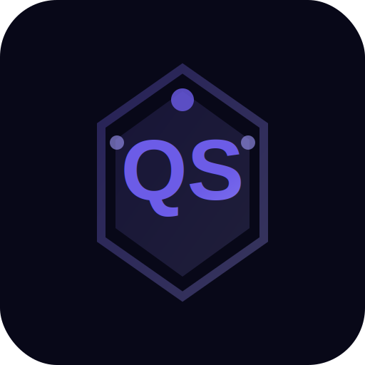

<p align="center">
  
</p>

<h1 align="center">QuantumShield</h1>

<p align="center">
  <strong>Enterprise Post-Quantum Cryptography Migration Platform</strong><br/>
  Scan &middot; Analyze &middot; Migrate &mdash; Make your codebase quantum-safe
</p>

<p align="center">
  <a href="https://github.com/zhuj3188-ship-it/NIST/actions/workflows/ci.yml"></a>
  <a href="https://github.com/zhuj3188-ship-it/NIST/releases"></a>
  <a href="LICENSE"></a>
  = 18" />
  
  
  
  <a href="https://github.com/zhuj3188-ship-it/NIST/issues"></a>
</p>

<p align="center">
  <a href="#-quick-start">Quick Start</a> &bull;
  <a href="#-features">Features</a> &bull;
  <a href="#-architecture">Architecture</a> &bull;
  <a href="#-supported-languages">Languages</a> &bull;
  <a href="#-desktop-app">Desktop App</a> &bull;
  <a href="#-api-reference">API</a> &bull;
  <a href="#-cicd-integration">CI/CD</a> &bull;
  <a href="README_CN.md">中文文档</a>
</p>

---

## What is QuantumShield?

**QuantumShield** is an open-source, enterprise-grade platform that helps development teams **discover**, **assess**, and **migrate** classical cryptographic algorithms to post-quantum safe alternatives — aligned with **NIST FIPS 203 (ML-KEM)**, **FIPS 204 (ML-DSA)**, and **FIPS 205 (SLH-DSA)**.

> **Quantum computers are coming.** RSA-2048 could be broken by ~2033. QuantumShield helps you prepare today.

### The Three-Step Workflow

```
┌─────────┐     ┌─────────┐     ┌─────────┐
│  SCAN   │ ──▶ │ ANALYZE │ ──▶ │ MIGRATE │
│         │     │         │     │         │
│ 400+    │     │ Risk    │     │ Code    │
│ regex   │     │ scoring │     │ gen +   │
│ rules   │     │ CVSS    │     │ roadmap │
│ 11 lang │     │ HNDL    │     │ hybrid  │
└─────────┘     └─────────┘     └─────────┘
```

---

## Features

### Scan Engine (v5.0)
- **400+ detection rules** across 11 programming languages
- Aho-Corasick-style pre-filter for sub-second scanning
- Sliding-window context analysis + semantic flow analysis
- Bayesian confidence calibration per finding
- Cross-file dependency graph correlation
- Smart deduplication & incremental scan cache
- CVSS v3.1 auto-scoring
- Dependency file analysis (package.json, requirements.txt, go.mod, etc.)
- Certificate & key file detection
- Configuration file analysis (sshd_config, Terraform, etc.)

### Risk Analyzer
- Quantum vulnerability scoring (Shor / Grover attack modeling)
- **HNDL** (Harvest Now, Decrypt Later) threat analysis
- Business impact matrix & attack surface mapping
- Quantum timeline risk projection (2024–2035)
- Data retention period risk assessment
- Dependency chain risk propagation
- Executive summary & risk matrix generation

### Migration Engine
- **Three strategies**: Pure PQC, Hybrid (recommended), Crypto-Agility
- Code templates for 8 languages (Python, JS, Java, Go, C, Rust, C#, PHP)
- Four-phase migration roadmap:
  1. Critical Fixes (immediate)
  2. Quantum-Critical Migration
  3. Hybrid Transition
  4. Validation & Compliance
- Auto-generated rollback scripts & unit test templates
- Effort estimation & priority scoring

### Compliance & Reporting
- **NIST IR-8547** compliance mapping
- **CNSA 2.0** (NSA) compliance
- **EU PQC Roadmap** alignment
- **NIST SP 800-131A** status
- CycloneDX 1.6 CBOM (Crypto Bill of Materials)
- SARIF 2.1.0 output (IDE/GitHub integration)
- Quantum Readiness Score (0–100 grading)
- HTML & JSON report export

### CI/CD Integration
- GitHub Actions generator
- GitLab CI generator
- Jenkins Pipeline generator
- Azure Pipelines generator
- Bitbucket Pipelines generator

### Desktop Application (Electron)
- Cross-platform: Windows, macOS, Linux
- System tray with quick actions
- Native folder scanning via file dialog
- Keyboard shortcuts for all major functions
- Dark & light theme support
- Bilingual UI (English / 中文)

---

## Supported Languages

| Language | File Extensions | Rules | Features |
|:---------|:---------------|:------|:---------|
| Python | `.py` | 40+ | cryptography, pycryptodome, hashlib, hmac, bcrypt, argon2 |
| JavaScript / TypeScript | `.js` `.ts` `.jsx` `.tsx` | 40+ | crypto, Web Crypto API, jsonwebtoken, crypto-js |
| Java | `.java` | 40+ | JCA/JCE, BouncyCastle, KeyPairGenerator, Cipher |
| Go | `.go` | 35+ | crypto/*, x/crypto, tls.Config |
| C / C++ | `.c` `.cpp` `.h` `.hpp` | 40+ | OpenSSL, libsodium, mbedTLS, wolfSSL |
| Rust | `.rs` | 30+ | ring, rust-crypto, openssl, RustCrypto |
| C# | `.cs` | 30+ | System.Security.Cryptography, BouncyCastle |
| PHP | `.php` | 25+ | openssl_*, sodium_*, hash(), mcrypt |
| Ruby | `.rb` | 20+ | OpenSSL, Digest, bcrypt-ruby |
| Kotlin / Scala | `.kt` `.scala` | 20+ | javax.crypto, java.security |
| Swift | `.swift` | 15+ | CryptoKit, Security.framework |
| Dart | `.dart` | 15+ | pointycastle, crypto |
| Config Files | `.conf` `.cfg` `.tf` `.yml` | 20+ | sshd_config, Terraform, nginx |
| Dependency Files | `package.json` `requirements.txt` etc. | 15+ | Dependency vulnerability scanning |

---

## Quick Start

### Prerequisites

- **Node.js** >= 18.0.0
- **npm** >= 9.0.0

### Installation

```bash
# Clone the repository
git clone https://github.com/zhuj3188-ship-it/NIST.git
cd NIST

# Install dependencies
npm install
cd client && npm install && cd ..

# Build the frontend
npm run build
```

### Running

#### Web Mode (Development)

```bash
# Start both server and client with hot-reload
npm run dev

# Server: http://localhost:3001
# Client: http://localhost:5173 (proxied to server)
```

#### Web Mode (Production)

```bash
# Build & start production server
npm run preview

# Visit http://localhost:3001
```

#### Desktop Mode (Electron)

```bash
# Development with hot-reload
npm run electron:dev

# Build desktop installers
npm run electron:build        # Current platform
npm run electron:win          # Windows (NSIS + Portable + ZIP)
npm run electron:mac          # macOS (DMG + ZIP)
npm run electron:linux        # Linux (AppImage + DEB + RPM + Snap + tar.gz)
npm run electron:all          # All platforms
```

### Quick Test

```bash
npm test
```

---

## Architecture

```
quantumshield/
├── client/                  # React + Vite frontend
│   ├── src/
│   │   ├── pages/           # Dashboard, Scanner, Migration, Compliance, Knowledge, Downloads, CICD
│   │   ├── components/      # Shared UI components
│   │   ├── contexts/        # Theme & i18n providers
│   │   ├── lib/             # API client & Web Worker
│   │   └── App.jsx          # Main application shell (Ant Design Pro Layout)
│   └── vite.config.js       # Vite config with engine file copy plugin
├── server/                  # Express.js backend
│   ├── engine/
│   │   ├── scanner.js       # Core scan engine (v5.0) — 400+ rules, Bayesian scoring
│   │   ├── rules.js         # Multi-language regex rule definitions (v6.0)
│   │   ├── models.js        # Data models, enums, quantum vulnerability DB
│   │   ├── risk-analyzer.js # Risk analysis engine (10-step pipeline)
│   │   ├── migration.js     # Migration plan generator (3 strategies × 8 langs)
│   │   └── compliance.js    # Compliance reporter (NIST, CNSA, EU, SARIF, CBOM)
│   ├── data/
│   │   ├── demo-files.js    # Built-in demo source files (12 languages)
│   │   └── pqc-knowledge.js # PQC algorithm data & quantum timeline
│   ├── routes/
│   │   └── api.js           # REST API endpoints (30+ routes)
│   └── index.js             # Express server entry point
├── electron/                # Electron desktop wrapper
│   ├── main.js              # Main process (window, tray, menu, IPC)
│   ├── icon.svg             # Application icon
│   ├── installer/           # NSIS installer customization
│   └── entitlements.mac.plist
├── tests/                   # Test suite
├── docs/                    # Documentation
├── .github/                 # GitHub Actions & templates
├── Dockerfile               # Container build
├── docker-compose.yml       # Container orchestration
└── package.json             # Root package (Electron + server)
```

### How the Engine Works

```
Source Files ──▶ Language Detection ──▶ Quick Screen (regex cache)
                                              │
                                              ▼
                                     Rule Matching (400+ patterns)
                                              │
                                              ▼
                                     Multi-Phase Filtering
                                     ├── Comment detection
                                     ├── Dead code detection
                                     ├── False positive patterns
                                     └── String literal check
                                              │
                                              ▼
                                     Enrichment
                                     ├── Key size extraction
                                     ├── Vulnerability DB lookup
                                     ├── Bayesian confidence
                                     ├── CVSS v3.1 scoring
                                     ├── External-facing detection
                                     └── Migration target selection
                                              │
                                              ▼
                                     Smart Deduplication ──▶ Findings
```

---

## API Reference

The server exposes a REST API on port `3001` (configurable via `PORT` env variable).

### Core Endpoints

| Method | Path | Description |
|:-------|:-----|:------------|
| `GET` | `/api/health` | Health check & engine status |
| `POST` | `/api/scan` | Scan code snippet(s) |
| `POST` | `/api/scan/files` | Scan uploaded files (multipart) |
| `POST` | `/api/scan/demo` | Scan built-in demo files |
| `GET` | `/api/scans/:id` | Retrieve scan results |
| `POST` | `/api/analyze/full` | Full batch analysis (scan + risk + migration) |
| `POST` | `/api/risk/analyze` | Risk analysis on scan results |
| `POST` | `/api/migration/full` | Generate migration plan |
| `POST` | `/api/migration/single` | Migrate a single finding |
| `GET` | `/api/compliance/scorecard/:id` | Quantum readiness scorecard |
| `GET` | `/api/compliance/cbom/:id` | CycloneDX CBOM export |
| `GET` | `/api/compliance/sarif/:id` | SARIF 2.1.0 export |
| `GET` | `/api/compliance/report/:id` | Full compliance report |
| `GET` | `/api/knowledge/algorithms` | PQC algorithm database |
| `GET` | `/api/knowledge/timeline` | Quantum threat timeline |
| `GET` | `/api/dashboard/stats` | Dashboard statistics |
| `GET` | `/api/progress/:id` | SSE progress stream |
| `GET` | `/api/system/info` | System information |

### Example: Scan a Code Snippet

```bash
curl -X POST http://localhost:3001/api/scan \
  -H "Content-Type: application/json" \
  -d '{
    "files": [{
      "name": "example.py",
      "content": "from cryptography.hazmat.primitives.asymmetric import rsa\nkey = rsa.generate_private_key(public_exponent=65537, key_size=2048)"
    }],
    "projectName": "my-project"
  }'
```

---

## CI/CD Integration

QuantumShield can generate CI/CD pipeline configurations for your project:

```bash
# Via API
curl http://localhost:3001/api/cicd/generate?platform=github

# Supported platforms: github, gitlab, jenkins, azure, bitbucket
```

### GitHub Actions Example

```yaml
# .github/workflows/quantum-scan.yml
name: Quantum Security Scan
on: [push, pull_request]
jobs:
  scan:
    runs-on: ubuntu-latest
    steps:
      - uses: actions/checkout@v4
      - uses: actions/setup-node@v4
        with:
          node-version: '20'
      - run: |
          git clone https://github.com/zhuj3188-ship-it/NIST.git /tmp/qs
          cd /tmp/qs && npm install
          node -e "
            const Scanner = require('./server/engine/scanner');
            const fs = require('fs');
            const path = require('path');
            // Scan your source files...
          "
```

---

## Docker

```bash
# Build
docker build -t quantumshield .

# Run
docker run -p 3001:3001 quantumshield

# Or with docker-compose
docker-compose up -d
```

---

## Desktop Downloads

Pre-built desktop installers are available on the [Releases page](https://github.com/zhuj3188-ship-it/NIST/releases).

| Platform | Format | Architecture |
|:---------|:-------|:-------------|
| Windows | NSIS Installer, Portable, ZIP | x64, arm64 |
| macOS | DMG, ZIP | x64 (Intel), arm64 (Apple Silicon) |
| Linux | AppImage, DEB, RPM, Snap, tar.gz | x64, arm64 |

---

## Post-Quantum Algorithms Supported

| Algorithm | NIST Standard | Replaces | Use Case |
|:----------|:-------------|:---------|:---------|
| **ML-KEM** (Kyber) | FIPS 203 | RSA, ECDH, DH, X25519 | Key Encapsulation |
| **ML-DSA** (Dilithium) | FIPS 204 | RSA, ECDSA, EdDSA, DSA | Digital Signatures |
| **SLH-DSA** (SPHINCS+) | FIPS 205 | RSA, ECDSA | Hash-based Signatures |
| **SHA-3** (Keccak) | FIPS 202 | MD5, SHA-1 | Hashing |
| **AES-256** | FIPS 197 | DES, 3DES, RC4, Blowfish | Symmetric Encryption |

---

## Configuration

### Environment Variables

| Variable | Default | Description |
|:---------|:--------|:------------|
| `PORT` | `3001` | Server port |
| `NODE_ENV` | `development` | Environment mode |
| `HOST` | `0.0.0.0` | Bind address |

See [`.env.example`](.env.example) for a full list.

---

## Contributing

We welcome contributions! Please see [CONTRIBUTING.md](CONTRIBUTING.md) for guidelines.

1. Fork the repository
2. Create your feature branch (`git checkout -b feature/amazing-feature`)
3. Commit your changes (`git commit -m 'feat: add amazing feature'`)
4. Push to the branch (`git push origin feature/amazing-feature`)
5. Open a Pull Request

---

## Security

For reporting security vulnerabilities, please see [SECURITY.md](SECURITY.md).

**Important:** QuantumShield performs all scanning locally. Your source code never leaves your machine.

---

## License

This project is licensed under the **MIT License** — see the [LICENSE](LICENSE) file for details.

---

## Acknowledgments

- [NIST Post-Quantum Cryptography Standardization](https://csrc.nist.gov/projects/post-quantum-cryptography)
- [NIST FIPS 203 (ML-KEM)](https://csrc.nist.gov/pubs/fips/203/final)
- [NIST FIPS 204 (ML-DSA)](https://csrc.nist.gov/pubs/fips/204/final)
- [NIST FIPS 205 (SLH-DSA)](https://csrc.nist.gov/pubs/fips/205/final)
- [NIST IR 8547 — Transition to Post-Quantum Cryptography Standards](https://csrc.nist.gov/pubs/ir/8547/final)
- [CNSA 2.0](https://media.defense.gov/2022/Sep/07/2003071834/-1/-1/0/CSA_CNSA_2.0_ALGORITHMS_.PDF)

---

<p align="center">
  <strong>QuantumShield</strong> &mdash; Preparing your code for the post-quantum era.<br/>
  <a href="https://github.com/zhuj3188-ship-it/NIST">GitHub</a> &bull;
  <a href="https://github.com/zhuj3188-ship-it/NIST/issues">Issues</a> &bull;
  <a href="https://github.com/zhuj3188-ship-it/NIST/releases">Releases</a>
</p>
